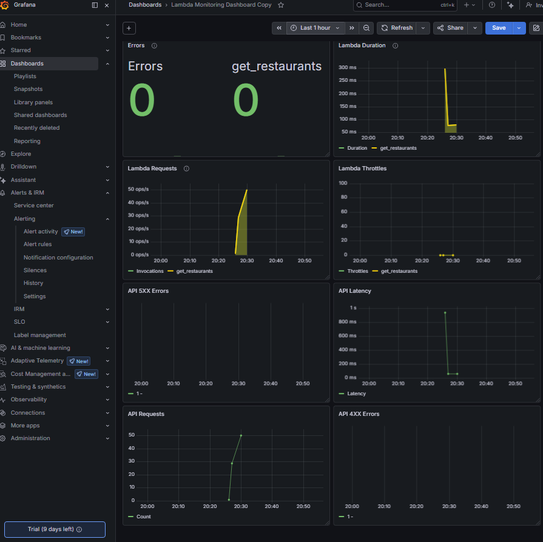
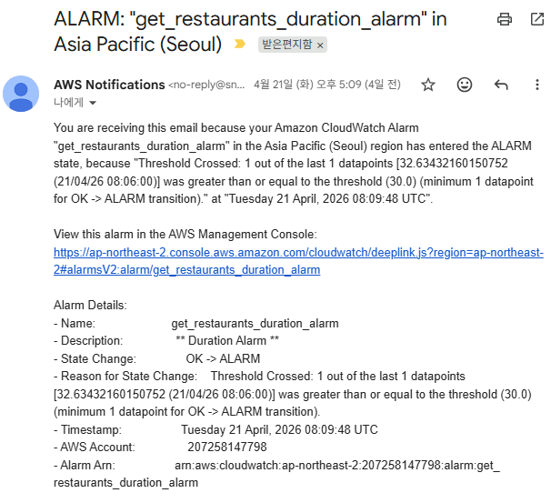
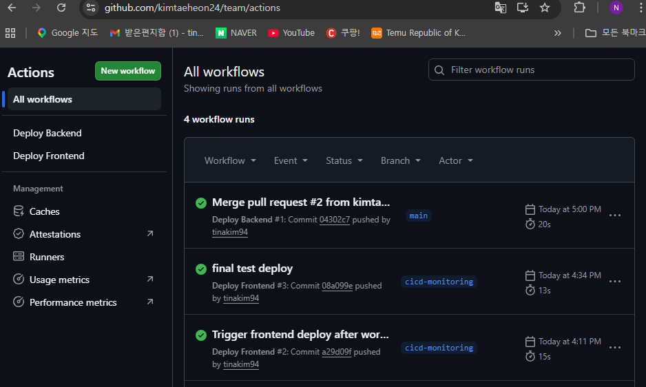

# Monitoring
See [monitoring/README.md](monitoring/README.md) for additional screenshots and details.
This folder documents the monitoring part of the SolPl project.

## Stack

```text
API Gateway / Lambda
        ↓
Amazon CloudWatch
        ↓
Grafana Cloud
```

## Observed Metrics

- API Requests
- API Latency
- API 4XX / 5XX Errors
- Lambda Duration
- Lambda Errors
- Lambda Throttles

## Validation Method

k6 was used to:
- generate API traffic
- increase request volume
- generate selected error cases
- observe changes in CloudWatch / Grafana metrics

## Screenshots

### Grafana Dashboard


### CloudWatch Alarms


### GitHub Actions Deployment

If you own the screenshots and they contain no sensitive information, you can add:

```text
monitoring/
├─ grafana-dashboard.png
├─ cloudwatch-alarm.png
└─ github-actions-run.png
```

Before uploading, blur or remove:
- AWS account IDs
- user names
- email addresses
- endpoint secrets
- internal resource names that should not be public
